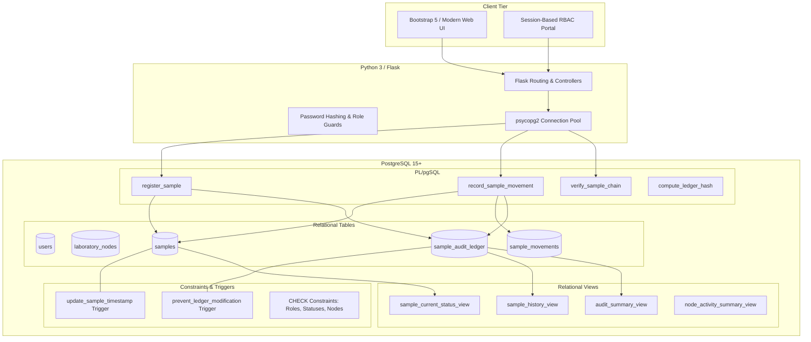
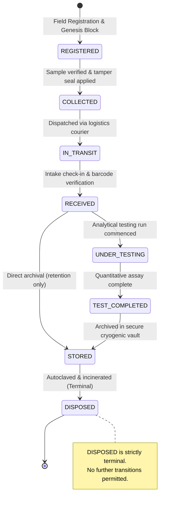

# TraceLedger – Tamper-Resistant Sample Lifecycle Tracking and Audit System

> **A 2nd-Year B.Tech AI & Data Science Database Management Systems (DBMS) Capstone Project**  
> *Enforcing database-level immutability, cryptographic SHA-256 hash chaining, atomic state transitions, and strict Chain of Custody for physical specimen lifecycles.*

---

## 1. Project Title & Overview

**TraceLedger** is an enterprise-grade web application engineered to track and audit the complete physical lifecycle of laboratory, clinical, and environmental samples—from initial field registration to final destruction.

Unlike conventional database applications that permit administrative overwrites or soft-deletes, TraceLedger implements a **tamper-resistant, hash-linked, append-only database audit ledger** powered by **PostgreSQL 15+** and **Python Flask**. 

> **Important Conceptual Note**: This system is **not** a blockchain. It is a **tamper-resistant, hash-linked, append-only relational database audit ledger** where immutability and state progression are enforced directly inside the relational database engine via PL/pgSQL triggers, constraints, and stored procedures.

---

## 2. Problem Statement

In regulated clinical, forensic, and environmental testing laboratories, the integrity of a physical specimen's **Chain of Custody (CoC)** is paramount. Real-world laboratory databases frequently suffer from vulnerabilities:
1. **Unchecked Historical Alteration**: Malicious or accidental `UPDATE` / `DELETE` operations executed by database administrators (`DBA`) can erase custody gaps, falsify temperature logs, or alter test results without detection.
2. **Invalid State Skips**: Samples are moved directly from field intake to archiving without undergoing mandatory transit reception or analytical testing runs.
3. **Absence of Cryptographic Verification**: Traditional database logs do not cryptographically bind sequential events together; tampering with an intermediate record goes completely unnoticed during compliance audits.

---

## 3. Proposed Solution

TraceLedger solves these challenges by combining relational database rigor with cryptographic hashing:
- **Append-Only Immutability**: A PostgreSQL `BEFORE UPDATE OR DELETE` trigger on `sample_audit_ledger` intercepts and aborts any modification attempts at the database engine level.
- **SHA-256 Hash Chaining**: Every state event computes a canonical payload and links to the previous block's SHA-256 digest (`previous_hash`), forming a verifiable cryptographic chain.
- **Database-Enforced State Machine**: PL/pgSQL stored procedures enforce valid forward transitions and reject illegal state jumps before committing.
- **Atomic Operations**: All state changes, movement logs, and ledger appends execute within a single atomic database transaction (`BEGIN ... COMMIT / ROLLBACK`).
- **Interactive Integrity Verifier**: An automated verification routine iterates through all samples, recalculates SHA-256 signatures, and verifies pointer continuity.

---

## 4. Architecture Diagram



---

## 5. Lifecycle State Transition Diagram

The application enforces a strictly defined forward state machine. Arbitrary skips, loops, or backwards transitions are rejected by the database.



---

## 6. Cryptographic Hash-Chaining Mechanism

For every sample, the audit ledger forms an append-only chain where each record references its predecessor by `ledger_id` and `record_hash`:

```text
+----------------------------+       +----------------------------+       +----------------------------+
| Block #1 (Genesis)         |       | Block #2 (Collection)      |       | Block #3 (Transit)         |
| ledger_id: 101             |       | ledger_id: 102             |       | ledger_id: 103             |
| previous_ledger_id: NULL   | <----+| previous_ledger_id: 101    | <----+| previous_ledger_id: 102    |
| status: REGISTERED         |       | status: COLLECTED          |       | status: IN_TRANSIT         |
| prev_hash: 000000000000... |       | prev_hash: e3b0c44298fc... |       | prev_hash: 7d1a55b28c01... |
| record_hash: e3b0c442...   +-------+ record_hash: 7d1a55b2...   +-------+ record_hash: 99f4a108...   |
+----------------------------+       +----------------------------+       +----------------------------+
```

### Hash Computation Formula:
```text
record_hash = SHA-256(
    sample_id |
    previous_ledger_id |
    from_node_id |
    to_node_id |
    action_type |
    old_status |
    new_status |
    performed_by |
    event_timestamp (ISO-8601 UTC) |
    remarks |
    previous_hash
)
```

If an attacker modifies even a single character in an existing record (e.g. altering `old_status` or `remarks`), the computed SHA-256 digest diverges, immediately triggering an **INTEGRITY VIOLATION DETECTED** alert during verification.

---

## 7. Technology Stack

- **Backend**: Python 3.10+, Flask 3.0+
- **Database Engine**: PostgreSQL 15+ (tested on PostgreSQL 15 & 16)
- **Database Driver**: `psycopg2-binary` (Connection Pooling & Parameterized SQL)
- **Procedural Logic**: PL/pgSQL (Stored Functions, Triggers, Views)
- **Frontend**: HTML5, CSS3, JavaScript (ES6+), Bootstrap 5.3, Bootstrap Icons
- **Cryptographic Library**: `pgcrypto` (PostgreSQL extension) & Python `hashlib`
- **Testing**: `unittest` & `pytest`

---

## 8. Database Schema Overview

The database contains 5 core tables with strict referential constraints:

| Table | Primary Key | Key Foreign Keys | Purpose |
| :--- | :--- | :--- | :--- |
| `users` | `user_id` | — | System actors and role assignments (RBAC) |
| `laboratory_nodes` | `node_id` | — | Physical checkpoints (collection, labs, hubs, vaults) |
| `samples` | `sample_id` | `registered_by`, `current_node_id` | Physical specimen inventory and current state |
| `sample_movements` | `movement_id` | `sample_id`, `from_node_id`, `to_node_id`, `performed_by` | Operational movement audit log |
| `sample_audit_ledger` | `ledger_id` | `sample_id`, `previous_ledger_id`, `from_node_id`, `to_node_id`, `performed_by` | Append-only, tamper-resistant SHA-256 chained ledger |

---

## 9. Installation & Setup Guide

### Prerequisites
- Python 3.10 or higher installed
- PostgreSQL 15+ installed and running locally
- pgAdmin 4 or `psql` command-line utility
- Git

### Step 1: Clone the Repository
```bash
git clone https://github.com/your-username/TraceLedger.git
cd TraceLedger
```

### Step 2: Set Up Python Virtual Environment
```bash
# Windows (PowerShell / Command Prompt)
python -m venv venv
.\venv\Scripts\activate

# Linux / macOS
python3 -m venv venv
source venv/bin/activate
```

### Step 3: Install Required Dependencies
```bash
pip install -r requirements.txt
```

### Step 4: Configure PostgreSQL Database
1. Open pgAdmin 4 or your terminal:
```bash
# Connect to PostgreSQL as superuser
psql -U postgres
```

2. Create a fresh database:
```sql
CREATE DATABASE traceledger_db;
\c traceledger_db
```

3. Execute the SQL migration scripts in order:
```bash
psql -U postgres -d traceledger_db -f database/01_schema.sql
psql -U postgres -d traceledger_db -f database/02_functions.sql
psql -U postgres -d traceledger_db -f database/03_triggers.sql
psql -U postgres -d traceledger_db -f database/04_views.sql
psql -U postgres -d traceledger_db -f database/05_seed_data.sql
```
*(Alternatively, open each SQL file in pgAdmin's Query Tool and click Execute).*

### Step 5: Configure Environment Variables
Copy `.env.example` to `.env`:
```bash
cp .env.example .env
```
Edit `.env` with your PostgreSQL credentials:
```env
POSTGRES_HOST=localhost
POSTGRES_PORT=5432
POSTGRES_USER=postgres
POSTGRES_PASSWORD=your_postgres_password
POSTGRES_DB=traceledger_db
FLASK_SECRET_KEY=traceledger_capstone_secret_key_2026
```

### Step 6: Run the Web Application
```bash
python app.py
```
Open your browser and navigate to: **`http://localhost:5000`**

---

## 10. Demo User Accounts & Credentials

All demo accounts share the uniform password: **`TraceLedger2026!`**

| Username | Role | Permissions |
| :--- | :--- | :--- |
| `admin` | `ADMIN` | Full access, user creation, registration, movements, integrity audit |
| `tech_sarah` | `FIELD_TECHNICIAN` | Sample intake registration, initial collection movements |
| `courier_dave` | `TRANSPORTER` | In-transit custody handovers between transport hubs and labs |
| `analyst_raj` | `LAB_ANALYST` | Commencing analytical runs, completing spectrometry assays, storage |
| `auditor_elena` | `AUDITOR` | Read-only compliance access, full ledger inspection, cryptographic verification |

---

## 11. Five Steps to Test and Evaluate the Application

1. **Log in as Field Technician (`tech_sarah`)**:
   - Navigate to **Register Specimen**.
   - Register a new water specimen: `SMP-2026-TEST`.
   - Observe the success banner displaying the generated Genesis SHA-256 hash.
2. **Move Specimen to `COLLECTED`**:
   - Navigate to **Record Movement**.
   - Notice that from `REGISTERED`, the dropdown only allows transitioning to `COLLECTED`.
   - Submit the movement and see Block #2 appended.
3. **Log in as Transporter (`courier_dave`)**:
   - Transition `SMP-2026-TEST` from `COLLECTED` to `IN_TRANSIT` with handover notes.
4. **Log in as Auditor (`auditor_elena`)**:
   - Open **Audit Ledger**: Notice the strict chronological block sequence with predecessor hashes.
   - Open **Integrity Verifier**: Click **Re-Run Verification** to verify that all mathematical invariants evaluate to `INTACT`.
5. **Demonstrate Database Immutability in pgAdmin**:
   - Open pgAdmin Query Tool and attempt a malicious update:
     ```sql
     UPDATE sample_audit_ledger SET action_type = 'HACKED' WHERE ledger_id = 1;
     ```
   - Observe PostgreSQL rejecting the command with error:
     `ERROR: Audit ledger records are immutable. UPDATE operations are strictly prohibited on sample_audit_ledger.`

---

## 12. DBMS Concepts Demonstrated

This project is explicitly structured to exhibit the full syllabus of a 2nd-year B.Tech DBMS course:

1. **Data Definition Language (DDL)**: `CREATE TABLE`, `ALTER TABLE`, `DROP TABLE`, explicit column data typing, `TIMESTAMP WITH TIME ZONE`.
2. **Integrity Constraints**:
   - `PRIMARY KEY` (Auto-incrementing surrogate keys with sequences)
   - `FOREIGN KEY` (With `ON DELETE RESTRICT` for audit resilience)
   - `UNIQUE` constraints (enforcing globally unique sample codes and usernames)
   - `CHECK` constraints (enforcing allowable roles, status enums, node types, and hash lengths)
3. **Data Manipulation Language (DML)**: Parameterized `INSERT`, `UPDATE`, `SELECT ... FOR UPDATE` (row-level locking to avoid race conditions).
4. **Complex Queries**:
   - Inner and Outer `JOIN` across 4 normalized relations.
   - `GROUP BY`, `HAVING`, `MIN()`, `MAX()`, `COUNT()`.
   - Correlated scalar subqueries to retrieve latest block hashes.
5. **Database Views**:
   - `sample_current_status_view`: Real-time flattened view of current inventory.
   - `sample_history_view`: Full denormalized audit timeline.
   - `audit_summary_view`: Analytical metrics grouping blocks per specimen.
6. **PL/pgSQL Procedural Programming**:
   - User-defined functions (`compute_ledger_hash`, `validate_status_transition`).
   - Stored procedures with exception handling (`register_sample`, `record_sample_movement`).
   - Table-returning set functions (`verify_sample_chain`).
7. **Database Triggers**:
   - `BEFORE UPDATE OR DELETE` trigger on `sample_audit_ledger` raising exceptions to guarantee immutability.
   - `BEFORE UPDATE` trigger on `samples` to automate `updated_at` timestamps.
8. **Transactions (ACID Properties)**:
   - Atomicity & Isolation: Multi-table state updates wrapped in single transactions with immediate rollback on validation failure.
9. **Performance Optimization**: B-Tree Indexes on query filters, foreign keys, and hash lookup columns.

---

## 13. Running Automated Tests

Run the comprehensive unit test suite:
```bash
python -m unittest tests/test_app.py
```
Or with pytest:
```bash
pytest tests/
```

To run the SQL attack simulation in `psql`:
```bash
psql -U postgres -d traceledger_db -f database/06_demo_attacks_and_checks.sql
```

---

## 14. Viva Voice Defense Q&A

**Q1: Why is this not a blockchain?**  
*Answer*: A blockchain relies on decentralized, distributed peer-to-peer consensus (e.g. Proof of Work/Stake) and gossip protocols across untrusted nodes. TraceLedger is an enterprise **centralized relational database audit ledger** that utilizes cryptographic hash chaining and PL/pgSQL trigger-enforced immutability. It achieves high throughput and ACID guarantees while mathematically ensuring that internal database records cannot be silently manipulated.

**Q2: What prevents a database admin with `postgres` superuser access from modifying the ledger?**  
*Answer*: The `prevent_ledger_modification()` trigger executes on any `UPDATE` or `DELETE` regardless of user privileges. Even if a superuser disables the trigger, edits data, and re-enables it, the SHA-256 hash chain is immediately broken because subsequent blocks store the hash of the original unmodified predecessor. The `verify_sample_chain()` algorithm will catch the mismatch upon next verification.

**Q3: How is atomicity guaranteed during sample movement?**  
*Answer*: When `record_sample_movement()` executes, it uses `SELECT ... FOR UPDATE` to lock the sample row, validates the state transition, calculates the new hash, inserts into `sample_audit_ledger`, inserts into `sample_movements`, and updates `samples`. If any step fails, the entire transaction is rolled back via PostgreSQL's transaction manager.

---

## 15. Pushing to GitHub

```bash
git init
git add .
git commit -m "feat: complete TraceLedger DBMS audit system with PL/pgSQL triggers and SHA-256 chaining"
git branch -M main
git remote add origin https://github.com/your-username/TraceLedger.git
git push -u origin main
```

---

## 16. License

This project is licensed under the MIT License. Developed for academic submission and educational evaluation.
